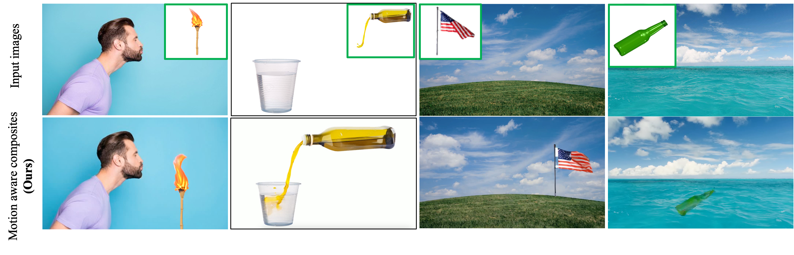

# MotionCom: Automatic and Motion-Aware Image Composition with LLM and Video Diffusion Prior



<!-- 
## [Paper](https://www.google.com) -->

### Weijing Tao, Xiaofeng Yang, Biwen Lei, Miaomiao Cui, Xuansong Xie, Guosheng Lin

# Abstract
> This work presents MotionCom, a training-free motion-aware diffusion based image composition, enabling automatic and seamless integration of target objects into new scenes with
dynamically coherent results without finetuning or optimization. Traditional approaches in this area suffer from two significant limitations: they require manual planning for object
placement and often generate static compositions lacking motion realism. MotionCom addresses these issues by utilizing
a Large Vision Language Model (LVLM) for intelligent planning, and a Video Diffusion prior for motion-infused image
synthesis, streamlining the composition process. Our multimodal Chain-of-Thought (CoT) prompting with LVLM auto-
mates the strategic placement planning of foreground objects,
considering their potential motion and interaction within the scenes. Complementing this, we propose a novel method MotionPaint to distill motion-aware information from pretrained
video diffusion models in the generation phase, ensuring that
these objects are not only seamlessly integrated but also endowed with realistic motion. Extensive quantitative and qualitative results highlight MotionCom’s superiority, showcasing its efficiency in streamlining the planning process and its
capability to produce compositions that authentically depict
motion and interaction.
>
***

## Requirements
We recommend using anaconda to manage the python environment. The setup commands below are provided for your reference.

```python
conda create -n motioncom python=3.9
conda activate motioncom
pip install -r requirements.txt
```


## Project Overview

This project is structured in two main parts, designed to accommodate users at different stages of image preparation.

### Part 1: Preparation of Composite Images
This part refers to stage 1 in the paper MotionCom, automatic planning by LVLM. This initial phase is geared towards users who need to create a composite image from scratch. It covers the essential steps for combining multiple images into a single composite, setting the foundation for the subsequent applications detailed in Part 2.


### Part 2: Application of Composite Images: MotionPaint
This part refers to stage 2 in the paper MotionCom, inpainting with pretrained video diffusion models. For users who already possess a composite image, this section should be your starting point. It focuses on applying these images directly to advanced processing techniques, allowing for immediate integration into your workflow or application. Navigate here to leverage pre-existing composite images for further development and analysis.

---

## Part 2: Application of Composite Images

You need to have an intermediate image that is static, and its mask. The intermediate image can be obtained from Part 1 through automatic positioning, or manual positioning of the foreground object in the background scene. Please note that the mask should not be exact, but instead a box that has ample space for dynamic motion of the foreground object. You may also define the unmasked areas as regions that you wish to expect dynamic interaction, not necessarily covering the entire foreground object. We suggest to use Powerpoint to create the mask. 

Folder ```figure``` contains example images and their masks for this part. Run the following command to generate a video (saved in ```output``` folder) where you can select the best frame for the final dynamic result. 


### Testing

To use our method, you can run `generate.py`. For example,

``` python 
### example 1
python generate.py --image_path "./figure/bottle.png" \
--mask_path "./figure/bottle_mask.png" \
--output_base_path "./output/bottle_" \
--num_videos 10 \
--save_frames

### example 2
python generate.py --image_path "./figure/oil.png" \
--mask_path "./figure/oil_mask.png" \
--output_base_path "./output/oil_" \
--seed 44320
```

We use [Stable Video Diffusion](https://huggingface.co/stabilityai/stable-video-diffusion-img2vid-xt) as our video diffusion model. To experiment with other diffusion models, you may modify the ```--model_path``` in `generate.py`.


## Part 1: Preparation of Composite Images

You may either prepare the intermediate composite images with manual or automatic placement of the foreground object into the background scene.

### Automatic planning
You need to have access to GPT-4V or other Large Vision Language Models. Our work is tested with GPT-4V. Before you begin, you need to supply GPT-4V with the in-context examples by uploading the file ```gpt-prompting.pdf```. You may then upload your own background image and foreground object together with the ```prompts.txt``` where you can insert the concise caption to help LVLM differentiate the two input images. This will output the split ratio S<sub>ratio</sub> and best region of insertion R<sup>*</sup>.

The code for the automatic composition using the output split ratio S<sub>ratio</sub> and best region of insertion R<sup>*</sup> will be uploaded soon.


 